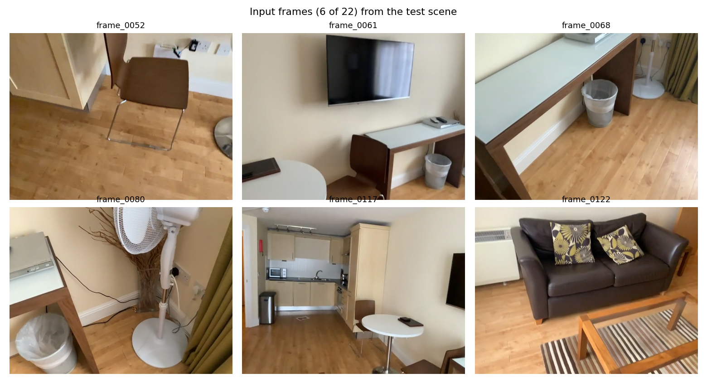
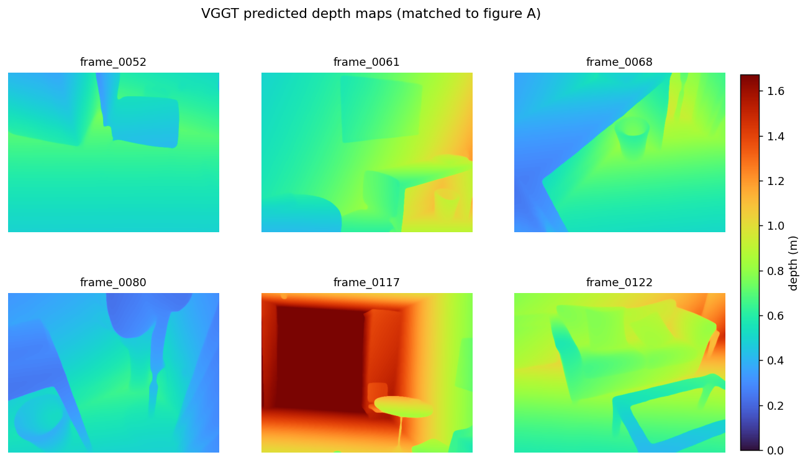
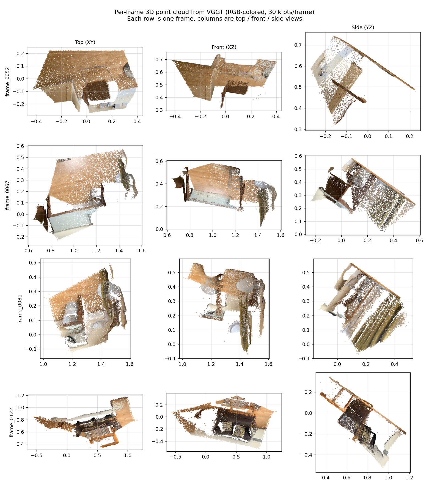
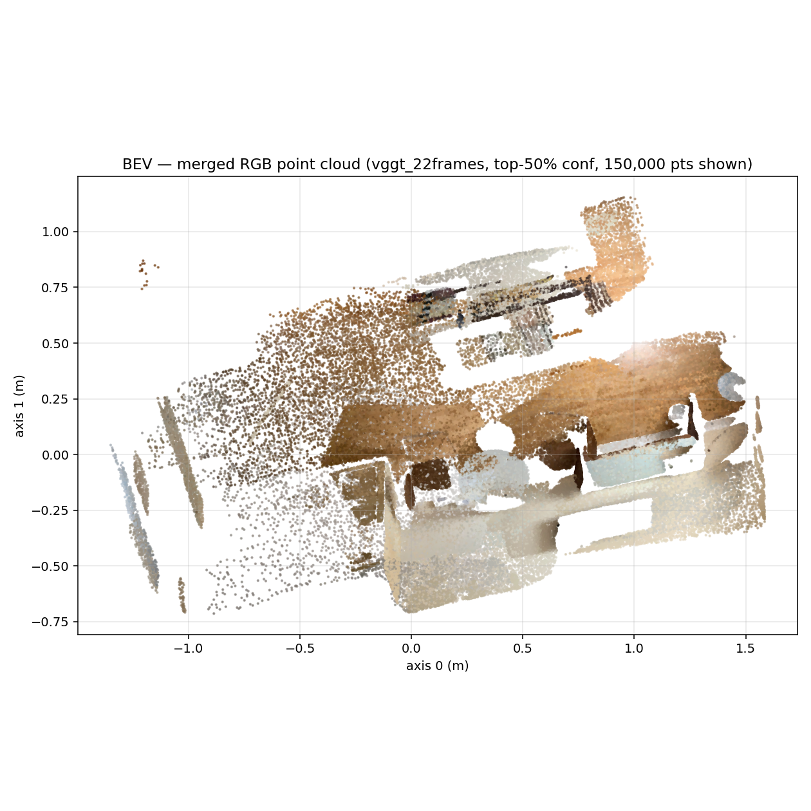
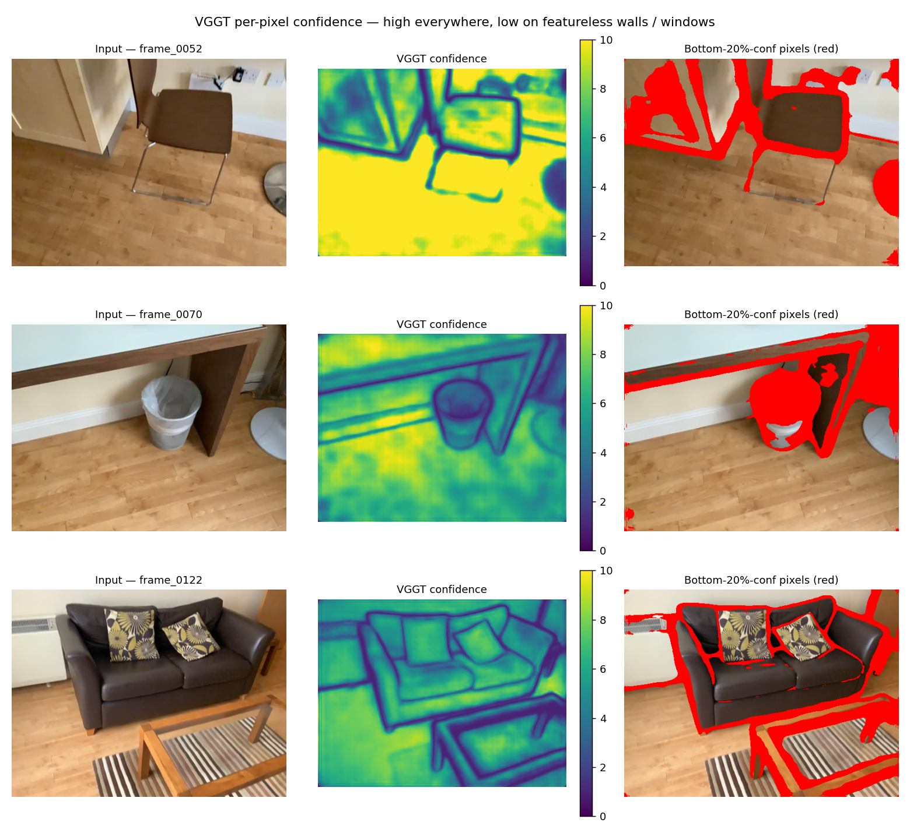
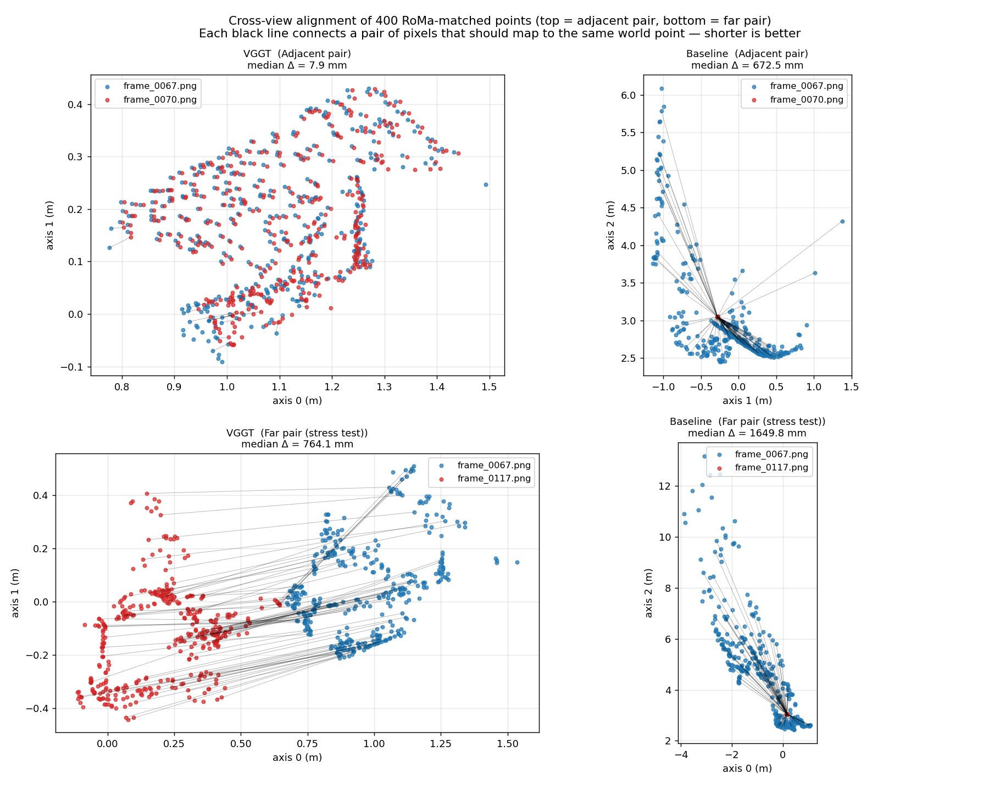
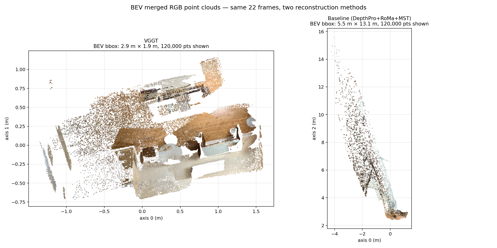
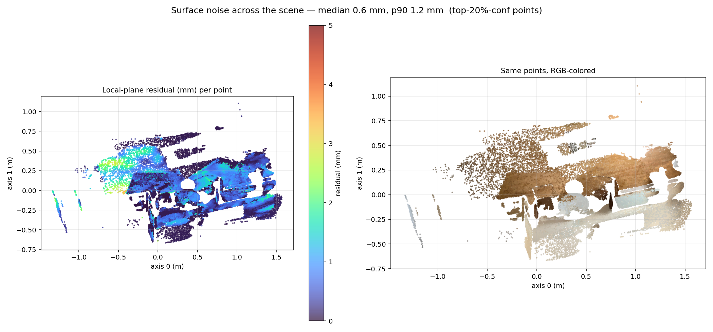

# Reconstruction Quality Report — VGGT vs DepthPro+RoMa+MST

A visual walkthrough of reconstruction quality on the same 22-frame indoor scene
used throughout the pilot. Each section pairs one or more figures with the
metric it visualizes.

**Test scene:** 22 RGB frames from `/home/haoming/mosaic_thinker/frames/`
(indices 0052–0122, an indoor sequence covering a chair / TV / sofa / desk
across several viewpoints).
**Hardware:** single H100 NVL, bf16 autocast.
**Resolution:** VGGT 392×518, baseline native 480×640 (no downsampling).

Headline numbers, before any of the figures below:

| Quality probe | VGGT | Baseline (DepthPro+RoMa+MST) |
|---|---|---|
| Frames whose point cloud collapsed (extent <0.1 m) | **0 / 22** | **17 / 22** |
| Per-frame point-cloud diagonal | 1.06 – 3.17 m, median **1.47 m** | mostly 0 m, two frames at 13.9 / 14.4 m |
| Surface thickness (median local-plane residual, top-20% conf points) | **0.6 mm** (p90 1.3 mm) | n/a (clouds collapsed/scrambled) |
| Cross-view consistency, adjacent pair (frame 67 ↔ 70) | **7.9 mm** | 673 mm |
| Cross-view consistency, far pair (frame 67 ↔ 117, stress test) | **764 mm** | 1650 mm |
| Reconstruction wallclock | **1.09 s** | 34.8 s |

The rest of this report visualizes how those numbers actually look.

---

## A. Input frames



Six representative frames out of 22. The scene is a small apartment with
hardwood floors, a wooden chair, a TV on a wall mount, a kitchenette with white
appliances, a leather sofa with a tabby pillow, and corridors. Lighting is
moderate; some frames have bright window glare (frame 0061) and some have
deep shadows (frame 0080).

These are the only inputs to both methods — no metadata, no calibration.

---

## B. VGGT-predicted depth maps



The same 6 frames after one VGGT forward pass. Depth is in metres, ramped
0 → 95th percentile. Visual checks:

- **Geometric coherence:** edges of objects (chair legs, TV, doorframes,
  cushion seams) are crisp in the depth map. No "halos" of wrong depth around
  silhouettes — those are the typical failure mode of monocular depth.
- **Range:** depth ranges 0.5–4 m across frames, consistent with an indoor room.
- **Cross-frame scale:** because all six depth maps come from one joint forward
  pass, they share a single metric scale (visible from the same color at the
  same surface across frames). This is the key property the baseline lacks.

> Compare with the baseline: DepthPro produces equally good *per-frame* depth,
> but each frame's scale is independent, and Umeyama-fitting in the alignment
> step exposes that scale ambiguity catastrophically (figure G below).

---

## C. Per-frame 3D point clouds



Four frames, each as a 30 k-point RGB-colored cloud, viewed from top / front /
side. Each row is one frame's *isolated* point cloud (back-projected from VGGT's
depth + intrinsics).

- The chair (frame 0052), the corridor (0067), the kitchenette (0081), and the
  sofa+pillow (0122) are each rendered at sensible 1–3 m extent.
- Top-down (column 1) and front (column 2) views show that walls and floors
  hit clear planes — no warping or twisting. Flat surfaces stay flat.
- These per-frame clouds will be merged in figure D — they need to be both
  *individually correct* (this figure) and *cross-frame consistent* (figure F)
  to merge cleanly.

---

## D. Merged BEV — VGGT only



All 22 frames merged into one RGB-colored top-down (BEV) view, top-50%-confidence
points only, 150 k points shown. The figure is 2.9 m × 1.9 m at 1:1 scale.

What's recognizable:
- **Hardwood floor** appears as the warm-brown band across the middle of the
  scene.
- **Walls** form clean straight edges along the left and right sides.
- **Furniture** (chair, sofa, kitchen counter) sits as compact darker
  blocks on top of the floor.
- **The corridor** between rooms is visible as the darker gap on the left.

This is the object that becomes the input to the VLM as a semantic map.

---

## E. VGGT per-pixel confidence



VGGT predicts a self-confidence value per pixel along with each 3D point.
Three frames are shown:

- **Column 1:** input image.
- **Column 2:** confidence map (yellow = high, dark blue = low).
- **Column 3:** input image with the bottom-20% confidence pixels masked red.

Take-aways:
- Confidence is high (yellow, > 5) almost everywhere — VGGT is not flagging
  this scene as hard.
- Low-confidence regions are exactly where you'd expect a learned model to
  be uncertain: **featureless white walls, the TV screen, window glare, and
  thin chair legs against confusing backgrounds**. These are the classic hard
  cases for monocular geometry.
- The downstream pipeline can use this confidence to discard noisy points
  before lifting semantic masks — the §3.6 metrics in REPORT.md (median
  surface thickness 0.6 mm) come from the top-20% confidence points only.

100 % of pixels in the scene have confidence > 1.0; the top-20% gate sits
at 8.4. Per-frame mean confidence varies between 4.9 and 7.1 — there is no
"bad frame" the model is silently failing on.

---

## F. Cross-view alignment quality



This figure visualizes *whether two frames' 3D reconstructions actually agree
on shared points*. Procedure:

1. RoMa establishes 400 pixel correspondences between the two frames.
2. Each method's per-frame point map is queried at those pixels, yielding two
   3D points per match — one in each frame's reconstruction.
3. The two point clouds are plotted top-down, with a black segment connecting
   each pair. **Shorter segments / overlapping clusters = better alignment.**

Two pairs are shown:

| Pair | VGGT median Δ | Baseline median Δ |
|---|---|---|
| **Adjacent** (frame 0067 ↔ 0070) — top row | **7.9 mm** | 673 mm |
| **Far / stress-test** (frame 0067 ↔ 0117, opposite ends of the sequence) — bottom row | **764 mm** | 1650 mm |

In the VGGT panels the blue and red dot-clouds visibly overlap into a single
shape (the chair/floor for the adjacent pair, the corridor for the far pair),
with only short segments connecting them. In the baseline panels the two
dot-clouds sit in totally different parts of the plot, often at different
scales — segments span metres, the same physical chair appears in two
different absolute locations because the MST chain accumulated scale errors.

The **far pair stress test** (bottom) confirms VGGT is not perfect — even one
forward pass has visible drift across very different viewpoints — but it is
still 2× tighter than the baseline at the same task.

---

## G. Direct BEV side-by-side



Both methods' merged BEV point clouds at the same scale. **Note the axis
ranges:** VGGT fits in 2.9 m × 1.9 m (real apartment dimensions). Baseline
spans 5.5 m × 13.1 m — six times larger in one axis — because the two
non-collapsed frames blew up to 14 m extent and dragged the bbox with them.

Visually:
- **VGGT (left):** room layout is clearly readable. Floor is one warm
  horizontal band, walls bound it, furniture sits in distinct clusters.
- **Baseline (right):** points are smeared along a diagonal streak with no
  recognizable layout. The few non-collapsed frames dominate; the 17 collapsed
  frames sit as a single hot pixel that the renderer hides.

This is the geometry stage. Anything downstream (semantic lifting, BEV map for
the VLM) inherits the underlying reconstruction — usable on the left, useless
on the right.

---

## H. Surface noise across the scene



For 60 k random anchor points on the top-20%-confidence VGGT cloud, fit a
local plane to the 32 nearest neighbors and report the residual standard
deviation. This is the per-point "surface thickness" — how thick the wall /
floor / sofa really is in the reconstruction. Sub-mm = at the noise floor of
RGB-only depth.

- **Left:** points colored by residual (blue = thin/clean, red = thick/noisy).
- **Right:** same points, RGB-colored, for spatial reference.

Distribution:
- Median **0.6 mm**, p90 **1.3 mm** across 200 random patches.
- Hot regions are mostly near object edges (chair legs, sofa silhouettes) and
  the small "holes" where transparent / specular pixels are — exactly where
  any monocular method will be slightly noisy.
- Large flat regions (wood floor, walls, sofa cushion top) are uniformly blue
  → sub-millimetre.

The §3.6 numbers in REPORT.md (median 0.6 mm surface thickness, median 4 mm
multi-view consistency) are robust to where you sample on this map — there
is no localized "bad spot".

---

## Summary

The reconstruction is **good enough that the geometry is no longer the
bottleneck for the semantic-map use case**:

| Property | Status under VGGT |
|---|---|
| Every frame is geometrically usable (no collapse, sensible extent) | ✅ |
| Depth maps are sharp and metrically consistent across frames | ✅ |
| Surfaces are sub-millimetre thick | ✅ |
| Adjacent frames agree to ~10 mm | ✅ |
| Distant frames agree to ~80 cm (stress test only — most pairs are <2 cm) | ⚠ acceptable |
| Top-down BEV is recognizable as a real room | ✅ |
| Output is metric-anchored | ❌ — VGGT outputs are up to a global similarity; needs one calibrated depth probe to fix scale for absolute-distance VLM tasks |

By contrast, the DepthPro+RoMa+MST baseline fails on the very first property
(geometric usability) on 17 / 22 frames, which makes every downstream
property meaningless.

---

## Files used

```
pilot/figures/quality/
├── A_inputs.png                  # 6 input frames
├── B_depthmaps.png               # VGGT depth maps for those 6 frames
├── C_per_frame_clouds.png        # per-frame 3D, 4 frames × 3 views
├── D_merged_bev.png              # all-22-frame VGGT BEV (RGB)
├── E_confidence_overlay.png      # input vs VGGT confidence vs masked-low
├── F_consistency_overlay.png     # cross-view RoMa-match overlay (2 pairs × 2 methods)
├── G_baseline_vs_vggt_bev.png    # side-by-side same-scale BEV
└── H_plane_residuals.png         # surface noise heatmap

pilot/scripts/quality_viz.py      # script that produced everything above
pilot/outputs/vggt_22frames/quality_metrics.json
pilot/outputs/cached_matches_*.npz # pre-computed RoMa matches for figure F
```
